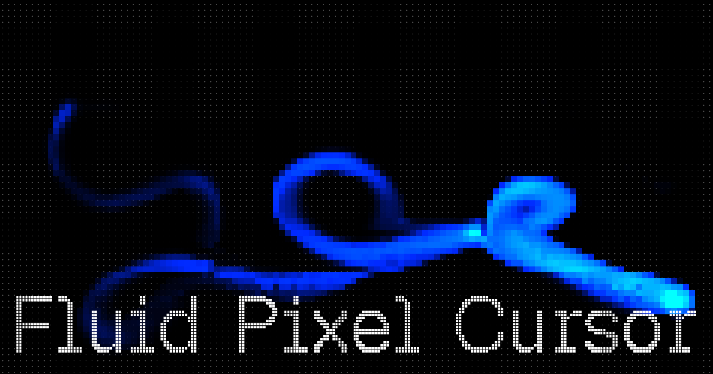

# Fluid Pixel Cursor

Real-time 2D fluid simulation that maps cursor and touch velocity into a pixelated dye field. Built with HTML, CSS, and vanilla JavaScript on the Canvas 2D API.

[Live demo](https://nestorrig.github.io/Fluid-Pixel-Cursor-Effect/)

## How it works

The effect runs on a fullscreen canvas with a lightweight 2D solver:

- Pointer motion is smoothed with friction, then converted into splat force and radius from cursor speed
- A velocity field is advected and made incompressible with a Jacobi pressure solve
- Dye density is advected with the flow and downsampled into a pixel grid for the final look
- Mouse and touch drive the same pointer path, so the trail works on desktop and mobile

Simulation, color, and pixel size can be tuned live with [Tweakpane](https://tweakpane.github.io/docs/). Presets include Balanced Flow, Brushing Flow, Fast cursor, Neon Pulse, and Vortex Heavy.

For grids, splat, advection, pressure, and the pixel blit, see the [technical notes](doc.md).

## Run locally

No build step. Serve the folder and open `index.html`:

```bash
npx serve .
```

## License

Released under the [MIT License](LICENSE).
