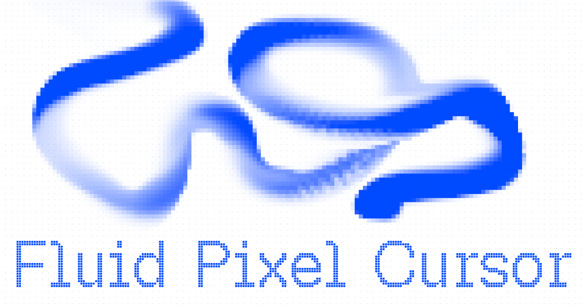

# Technical notes

This document describes the solver in [`js/script.js`](js/script.js). The implementation is a CPU-side, stable-fluids style 2D grid running on the Canvas 2D API. There is no WebGL.

The visual result is a pixelated dye trail driven by cursor and touch velocity. Dark mode keeps the original additive look; light mode keeps the accent hue and fades through alpha so the trail does not sink into black on white.




## Pipeline

Each animation frame does the same sequence:

1. Read pointer position and inject a splat into velocity and dye
2. Advect the velocity field (semi-Lagrangian)
3. Project velocity to be approximately divergence-free (Jacobi pressure)
4. Advect dye (`R`, `G`, `B`) through the updated velocity
5. Rasterize dye into `ImageData`, downsample to a pixel grid, blit to the screen canvas

`dt` is derived from `requestAnimationFrame` timestamps and clamped to `[0.001, 0.018]` so a stalled tab does not explode the solver.

## Grids and canvases

Three canvases stay in memory:

| Canvas | Role |
| --- | --- |
| `#fluid` | Visible fullscreen layer, sized to `visualViewport` × `devicePixelRatio` |
| `dyeCanvas` | Intermediate buffer that receives `ImageData` at simulation resolution |
| `pixelCanvas` | Low-resolution buffer used to quantize the dye into blocky pixels |

Simulation fields are packed as `Float32Array`s of length `simW * simH`, indexed with `x + y * simW`:

- `vx`, `vy` — velocity
- `pressure`, `divergence` — projection
- `dyeR`, `dyeG`, `dyeB` — transported color
- `*0` variants — ping-pong buffers for advection and Jacobi

On resize, height is `SIM_RESOLUTION` (min 48) and width keeps the viewport aspect. Changing `SIM_RESOLUTION` or `DYE_RESOLUTION` reallocates every field, so the fluid clears.

`#fluid` is `pointer-events: none`. Pointer events are read from `window`, not from the canvas.

## Pointer and touch

`mousemove` and `touchmove` write the same `pointer.targetX / targetY` in CSS pixels. Touch uses `{ passive: false }` and `preventDefault()` so the page does not scroll while drawing.

On coarse pointers (`hover: none` and `pointer: coarse`) the document also locks overflow and `touch-action`, so the trail stays fullscreen on mobile.

The displayed pointer is not the raw event. Each frame it eases toward the target:

```
smooth += (target - smooth) * FRICTION
```

`FRICTION` is a lerp factor, not physical friction. Higher values snap harder to the cursor. Speed is the Euclidean delta of that smoothed point, then clamped (`speed * 1.6` into `[0, 60]`) before it scales splat radius, force, and color intensity.

Injection only starts after the first move (`pointer.ready`), so the sim does not dump dye at the default center on load.

## Splat

`addSplat` writes a Gaussian impulse around the normalized pointer:

```
falloff = exp(-(dx² + dy²) / rad²)
```

The same kernel adds:

- velocity: `dx * force * dt`, `dy * force * dt`
- dye: accent color × intensity × per-channel multipliers

Radius and force are `SPLAT_*` plus the speed gains. The kernel is limited to a `2 * rad` AABB, so idle or slow motion stays cheap.

Color comes from `--accent-color` (or the Tweakpane hex), parsed to linear `[0, 1]` RGB.

## Advection

Velocity and dye use semi-Lagrangian advection. For each cell the solver traces backward along the current velocity:

```
back = cell - velocity * dt * (gridSize - 2)
```

The source is sampled with bilinear interpolation (`bilerp`) and multiplied by a dissipation factor:

- `VELOCITY_DISSIPATION` on `vx` / `vy`
- `DENSITY_DISSIPATION` on each dye channel

Values below `1` fade the trail. Values closer to `1` keep motion and color around longer. After each pass the source/destination arrays swap.

## Pressure projection

Splats add divergence. `solvePressure` removes most of it so the flow looks incompressible instead of just smearing:

1. Compute central-difference divergence and reset pressure to `0`
2. Iterate Jacobi: each cell becomes the average of its four neighbors minus divergence
3. Subtract the pressure gradient from velocity

`PRESSURE_ITERATIONS` is the quality/cost knob. The default (`10`) is a short, real-time solve, not a fully converged Poisson solution. Boundaries are skipped (`1 … size - 2`), which is enough for a decorative fullscreen field.

## Color scheme

Theme is `system`, `dark`, or `light`. System follows `prefers-color-scheme`. Manual picks set `data-theme` on `:root` and override the media query.

CSS swaps background, text, grid, and `#fluid` blend mode:

| Theme | Background | Text | Blend |
| --- | --- | --- | --- |
| Dark | `#000` | `#fff` | `screen` |
| Light | `#fff` | `--accent-color` | `multiply` |

Changing the Tweakpane hex writes back to `--accent-color`, so light-mode type stays matched to the dye.

## Pixel render

`renderDye` branches on the active theme.

**Dark** uses the original mapping: RGB is clamped to `1.6` and written as-is. Alpha is `max(r, g, b) * 1.4`. Density and speed show up as brighter, near-white cores, and the trail can decay toward black. That reads as glow on a dark field.

**Light** normalizes each cell to its hue, then puts fade only in alpha (`intensity * 1.85`). The trail stays the accent color instead of muddy gray. `#fluid` uses `multiply`, so the dye prints on white instead of washing out.

The image is drawn into `dyeCanvas` at `simW × simH`.

The pixel look is a two-step nearest-neighbor blit:

1. `dyeCanvas` → `pixelCanvas` at `floor(screen / (PIXEL_SIZE * dpr))`
2. `pixelCanvas` → `#fluid` at full device resolution, with `imageSmoothingEnabled = false`

Larger `PIXEL_SIZE` means fewer blocks and a chunkier cursor. Because the downsample includes `dpr`, the block size stays visually stable on retina displays.

## Frame order

```
updatePointerFluid
advectVelocity
solvePressure
advectScalar(dyeR, dyeG, dyeB)
renderDye
```

Dye is advected *after* projection, so color rides the cleaned velocity field, not the raw splat.

## Live controls

[Tweakpane](https://tweakpane.github.io/docs/) binds the same `config` object the solver reads. The Theme control (`System`, `Dark`, `Light`) is always visible. Presets (`balanced`, `brushing`, `fast`, `neon`, `vortex`) overwrite simulation values and call `resize()`. `Custom` only reveals the manual folders; it does not change values by itself.

`Clear Fluid` reallocates the field arrays, which zeroes velocity and dye.

| Group | What it changes |
| --- | --- |
| Theme | System color scheme, or forced dark / light |
| Simulation | Grid size, Jacobi iterations, dissipation, pixel block size |
| Pointer Splat | Smoothing, base impulse, speed-to-force / speed-to-radius |
| Color | Hex, base intensity, speed boost, RGB multipliers |
